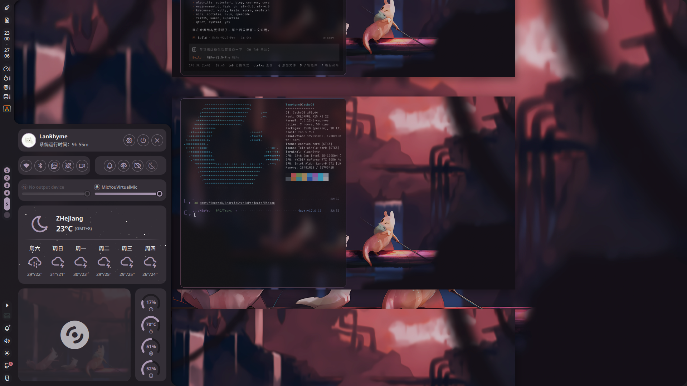

# CachyOS Dotfiles

使用 [chezmoi](https://www.chezmoi.io/) 管理的个人 CachyOS 极简、高度自动化配置文件集合

##  桌面截图



---

##  核心特性

- **全局动态主题**：基于 Noctalia 实现桌面壁纸色彩抓取，自动生成莫兰迪 (Morandi) 风格主题并全自动覆盖系统所有组件
- **全自动同步**：配置每 2 小时通过定时任务 (Cron) 自动推送到 GitHub
- **敏感文件保护**：严格区分开源配置与个人私钥，避免 Token 等机密信息外泄
- **一键极速恢复**：只需一条命令，即可在新设备上完整复刻工作流
- **模块化结构**：按应用和用途解耦配置，高度可维护

---

##  自动化脚本与文档索引

为了保持根目录整洁，各子系统的特定脚本均配备了独立的说明文档，点击下方链接深入了解：

* **[全局色彩生成系统 (Morandi)](dot_config/noctalia/README.md)**: 包含了 `morandi-gen.py` 和 `apply-morandi.sh` 的架构说明，以及如何扩展新应用配色的开发指南
* **[个人本地脚本库 (Local Bin)](dot_local/bin/README.md)**: 介绍了存放于 `~/.local/bin` 的所有快捷指令与自动化包装器（如配置同步器 `dotfiles-sync.sh`、环形菜单适配器 `kando-niri.sh` 以及可视化设置中心 `aether-hub.py`）

---

##  软件生态与依赖库

| 分类 | 软件 | 用途 |
|------|------|------|
| **基础环境** | [fish](https://fishshell.com/) / [starship](https://starship.rs/) | 交互式 Shell 及其终端提示符引擎 |
| **窗口管理** | [niri](https://github.com/YaLTeR/niri) | 现代化的无限滚动式 Wayland 合成器 |
| **桌面交互** | [noctalia](https://github.com/noctalia/noctalia-shell) / [kando](https://kando.menu/) | 桌面状态栏、全局环形快捷菜单 |
| **终端与编辑**| [alacritty](https://alacritty.org/) / [neovim](https://neovim.io/) / [micro](https://micro-editor.github.io/)| GPU 加速终端及多层次文本编辑器矩阵 |
| **生产力** | [fcitx5](https://fcitx-im.org/) / [Kdenlive](https://kdenlive.org/) / [Godot](https://godotengine.org/) | Rime输入法框架、专业视频剪辑与开源游戏开发引擎 |
| **系统监控** | [btop](https://github.com/aristocratos/btop) / [fastfetch](https://github.com/fastfetch-cli/fastfetch) | 终端资源监控与高度定制的系统信息打印 |
| **录制推流** | OBS Studio / gpu-screen-recorder | 基于显卡的高效硬件录屏录影工具 |
| **网络代理** | [FlClash](https://github.com/chen08209/FlClash) / [Clash Verge Rev](https://github.com/clash-verge-rev/clash-verge-rev) | 全局网络代理与配置可视化客户端 |
| **文件网络** | superfile / [KDE Connect](https://kdeconnect.kde.org/) / frp | TUI文件管理、移动端跨端协同、内网穿透工具 |
| **包管理** | [uv](https://github.com/astral-sh/uv) / yay / GitHub CLI | Python依赖锁、AUR软件安装、Github高效开发链 |

---

##  极速部署与恢复

在新机器上复刻本环境，请遵循以下流程：

### 1. 基础环境初始化
```bash
# 安装包管理器与代码同步工具
paru -S chezmoi git

# 拉取远程配置并自动覆盖到本地
chezmoi init --apply LanRhyme
```

### 2. 软件依赖一键安装
```bash
paru -S fish starship alacritty neovim micro \
        niri noctalia kando fcitx5-rime kvantum \
        btop cava superfile fastfetch chafa \
        obs-studio gpu-screen-recorder kdenlive krita \
        github-cli uv yay kdeconnect frpc \
        flclash-bin clash-verge-rev-bin
```

*(重启系统或重新登录后配置即可全部生效)*

---

##  核心配置文件导航

```text
dotfiles/
├── .chezmoiignore              # 排除敏感信息的黑名单规则
├── .bashrc / .zshrc / .gitconfig # 终端基础配置
└── .config/
    ├── alacritty/              # 终端仿真器视觉与快捷键
    ├── fish/                   # Shell 语法、插件、环境变量
    ├── niri/                   # Niri 工作区、键位、窗口规则 (Wayland)
    ├── noctalia/               # 桌面栏系统及 Morandi 主题引擎引擎
    ├── fcitx5/                 # 输入法引擎配置与 Rime 用户字典
    ├── superfile/              # 终端文件管理器偏好
    ├── environment.d/          # 全局用户级环境变量 (Systemd)
    └── autostart/              # 开机自动拉起的后台守护进程
└── .local/
    ├── bin/                    # 用户可执行脚本 (同步、快捷命令)
    └── share/color-schemes/    # KDE / Qt 程序的动态映射色彩文件
```

---

##  敏感文件隔离机制

为防止意外提交隐私数据，以下文件路径被长期写入 `.chezmoiignore`：

| 文件路径 | 隔离原因 |
|------|------|
| `kdeconnect/*.pem` | 设备双向互联的非对称加密私钥与证书 |
| `noctalia/plugins/github-feed/settings.json` | 包含 GitHub 账户私密 Token |
| `noctalia/plugins/github-feed/cache/` | API 请求暂存缓存，避免提交垃圾文件 |

如果您在二次开发时遇到新的密钥，务必执行：
```bash
echo "dot_config/app/secret.json" >> ~/.local/share/chezmoi/.chezmoiignore
```

---

##  配置同步指南

目前系统已被配置为 **每 2 小时** 自动通过脚本 `~/.local/bin/dotfiles-sync.sh` 在后台无感同步

若需手动操作，常用的 `chezmoi` 命令如下：
```bash
chezmoi add ~/.config/newapp    # 追踪并托管新的软件配置
chezmoi diff                    # 对比本地系统与源仓库的配置变化
chezmoi apply                   # 强制用仓库配置覆盖本地配置
chezmoi update                  # 拉取云端远程更新
chezmoi cd                      # 一键进入源文件夹修改配置
```

## 许可证

个人配置文件库，可自由复用与参考学习
